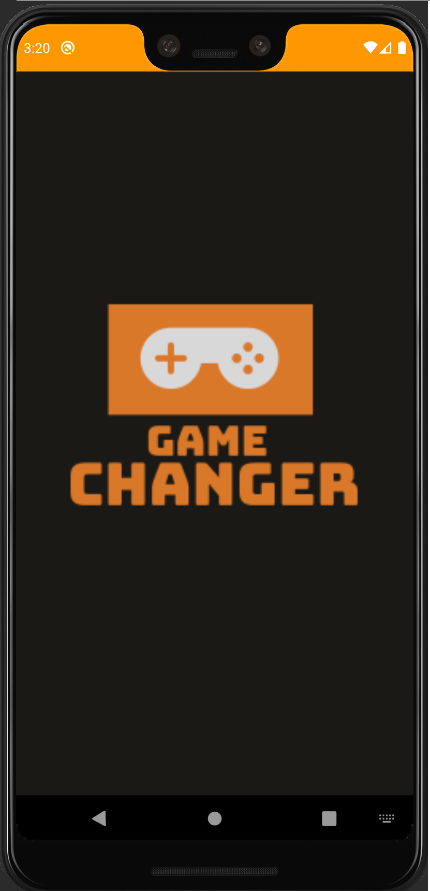
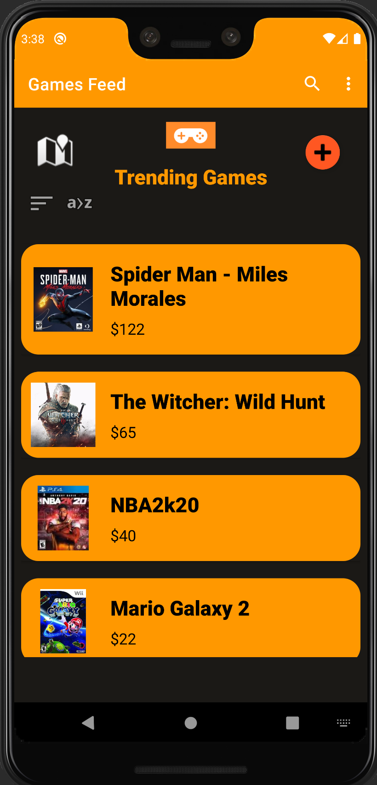

# GameChanger - Android Application
## Main Purpose
An application that will allow users to exchange physical copies of their video games with one another.

## Description
Today there is a large community of gamers around the world that owns physical copies of games, but once the game is completed, they no longer have any use for them.
Few gaming stores offer a membership option that allows customers to rent copies of games and return them to the store after a certain period of time. Another alternative is joining a Facebook group that allow you to post the games you own and what you wish to trade for them. 
The problem is that usually the renting option is pricey and unprofitable, and with Facebook it's not always easy to find people who own the games you wish to trade.
Our app will help with addressing these problems. The app will allow users to list the games they own and their wish-list, once another user will update the games he own, the app will identify "matches" and the two compatible users will be able to communicate.  

## App Functionality
1.	<b>Login Page</b> – user identification page and registration. 
2.	<b>User profile page</b> - will include the user's personal details and information, as well as the list of owned games. Other users will have an option to rate your profile based on your credibility in regards with past trade experience they had with you. 
3.	<b>Main feed</b> – randomly shows content and most relevant games depending on the user's choices and can also be filtered.
4.	<b>Add new item page</b> – will contain all the relevant information about the game you wish to trade.
5.	<b>Transaction page</b> – Users that will be matched together will be transferred to this page in order to discuss specifics about the trade, such as their wanted price, time and location of the trade. 

## Images From App

  

    

      
 

    

    

     
 

    

  

## Installation

- Export git repositorie to andorid studio
- Build and run the application on a physical device or andorid emulator

## Developed by:
* **Eden Shtein** - [LinkedIn](https://www.linkedin.com/in/edenshtein/)
* **Omer Berger** - [LinkedIn](https://www.linkedin.com/in/omerberger/)
* **Or Levi** - [LinkedIn](https://www.linkedin.com/in/orlevi13/)
* **Rom Sanitovsky** - [LinkedIn](https://www.linkedin.com/in/rom-sanitovsky-a38272197/)
